.. deployment .

.. contents:: Chapters
  :depth: 2

---------------------
System Deployment
---------------------

The Nano has an installer for automated deployment, get the latest version from the `official website <https://nanos.cloud/en-us/download.html>`_ or on `Github <https://github.com/project-nano/releases/releases>`_.

**For new users, it highly recommends that don't adjust configuration when installing the first time**, the installer will choose appropriate parameters.

Minimal System Requirements:

- Virtualization enabled X86 servers, or nested virtualization enabled virtual machines(Intel VT-x/AMD-v)
- 2 cores/4 GB memory/50 GB disk/1 network interface
- CentOS 7.6(1810) Minimal
- Operation system installed with network ready
- If you have raid or LVM, please configure them before installing Nano.

It recommends installing on a pure CentOS 7.6 system without any extra packages.

Install Modules
===================

Download and unzip the package. Execute the installer and choose the modules needed to install.

execute the following instructions:

::

  $wget https://nanos.cloud/media/nano_installer_1.0.0.tar.gz
  $tar zxfv nano_installer_1.0.0.tar.gz
  $cd nano_installer
  $./installer

After the Installer starts, you are asked to choose the modules to install.

For example, "2" for the Cell only, and "3" for installing all module on current.

All modules installed in the directory: /opt/nano, and with domain identity "<nano: 224.0.0.226:5599>" by default.

It is not recommended to change the default parameters for first-time installation or only one domain in LAN.

The installer will ask the user to enter "yes" to build a bridged network "br0" before installing the Cell.

It recommends that remove previous "br0" not generated by Nano before installing.

 *A known issue is that the SSH connection will interrupt on some servers when the installer configures the bridged network, resulting in an installation failure. Use IPMI or iDRAC to execute the installer if you encounter the above issue.*

The installer will ask you to choose a network interface to work on if there are multiple networks available on the current server.

For example, If the server has two network interfaces, the eth0 address is "192.168.1.56/24", and the eth1 address is "172.16.8.55/24". If you want the Nano to work on the segment "172.16.8.0/24", choose "eth1".

 *Note: when installing the dependent library, the installer will try the built-in RPM packages first. If any error occurs, it will use yum instead, so keep your network available.*

Start Modules
=======================

All Nano modules provide the command-line interface, and called like :< module name > [start | stop | status | halt].

- start: start module service, output error message when start failed, or version information.
- stop: stops the service gracefully. Releases allocated resources and notify any related modules.
- status: checks if the module is running.
- halt: terminate service immediately.

You need to start the module to provide services, and all binaries are installed in the directory "/opt/nano" by default.

**Please remember, always start the Core service first.**

::

  $cd /opt/nano/core
  $./core start
  $cd ../cell
  $./cell start
  $ cd ../frontend
  $./frontend start

When the FrontEnd module successfully started, it will give you a listen address likes"192.168.6.3:5870". Using Chrome or Firefox open this web portal to manage your newly installed Nano platform.

Initial System
========================

The first time you open the Nano Web portal, you will be prompted to create an initial administrator.

The password must be no less than 8 digits long and require a number, a lowercase letter, and an uppercase letter at least.

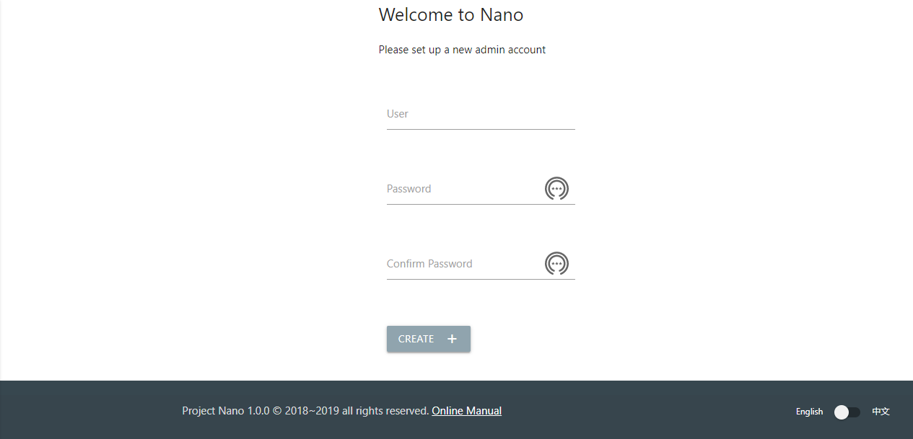

After you log in, you can start managing the Nano platform or creating more user accounts for your team.

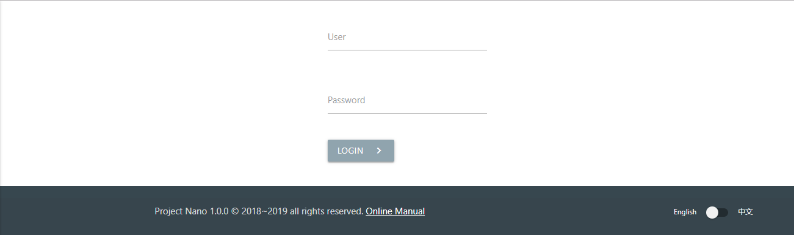

The logged-in user display at the bottom of pages, and you can click to log out.

.. image:: images/2_logout.png

Setup shared storage (optional)
====================================

By default, the disk data of an instance stores in the local storage of the Cell node, which is the most cost-effective and no additional configuration required.

However, the administrator can also configure to store data on an NFS file server which enable fail-over or migrating, to improve the overall availability and device lifespan.

To use shared storage, just creating a storage pool and attach it to a computing resource pool. Then all instance allocated in this resource pool will use shared storage automated.

A storage pool corresponds to a shared storage path. A storage pool can back multiple computing pools at the same time, but each computing resource pool can only attach one storage pool.

Configure NFS Server
...............................

You need to configure the NFS server before using shared storage.

assume a shared path "/var/nano" on an NFS server "192.168.3.138", working on a Nano domain "192.168.3.0/24".

Take CentOS 7.6 as an example, execute the following instructions on the NFS Server-side:

::

    Open port on firewalld
    $firewall-cmd --zone=public --add-service=nfs --permanent
    $firewall-cmd --reload

    Install the NFS service and enable startup on boot.
    $yum install nfs-utils
    $systemctl start nfs
    $systemctl enable nfs

    Create storage path
    $mkdir -p /var/nfs/nano

Cause NFS maps client users to server users for permission check, administrators need to configure different access rules when running Nano with different users.

Using a root user to run Nano
,,,,,,,,,,,,,,,,,,,,,,,,,,,,,,,,,,,,

NFS forbidden mapping root user by default, so the "no_root_squash" option must enable when configuring paths.

Execute on NFS Server

::

  Write mapping rule
  $vi /etc/exports

  /var/nfs/nano 192.168.3.0/24(rw,sync,no_subtree_check,no_root_squash)

  Mapping shared path
  $exportfs -a

Using a non-root user to run Nano
,,,,,,,,,,,,,,,,,,,,,,,,,,,,,,,,,,,,,,

For non-root users, NFS map client-side account to server-side account with identical user/group ID.

Assuming that the Cell is running Nano with the user and group "nano/nano", corresponding to a user/group ID: 108. You need to create a user and group with the same ID in NFS Server and set it to the owner of the shared path.

Execute on NFS Server:

::

  $groupadd nano -g 108
  $useradd nano -u 108 -g nano -Z system_u
  $chown nano:nano /var/nfs/nano
  $chmod 755 /var/nfs/nano

Export shared path

::

  Write mapping rule
  #vi /etc/exports

  /var/nfs/nano 192.168.3.0/24(rw,sync,no_subtree_check)

  Mapping shared path
  #exportfs -a

----

**please manually mount shared NFS path on the client-side before further configure, to make sure the previous configuration is correct.**

Create Storage Pool
...........................

Select "Storage" = > "Create" on the Web portal for a new shared storage pool.

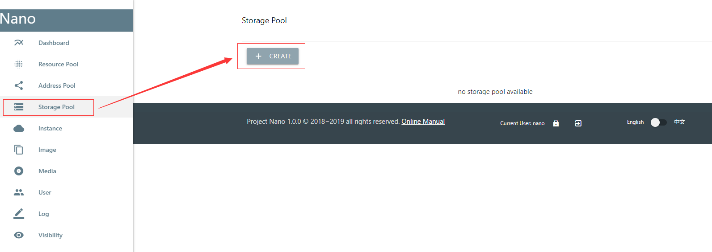

Create a new pool with name "nfs-pool1", address "192.168.3.138" and path "/var/nfs/nano"

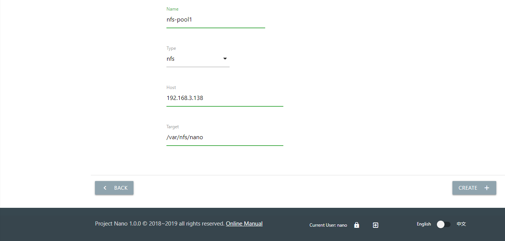

Return to the list after creation, to see the new storage pool.

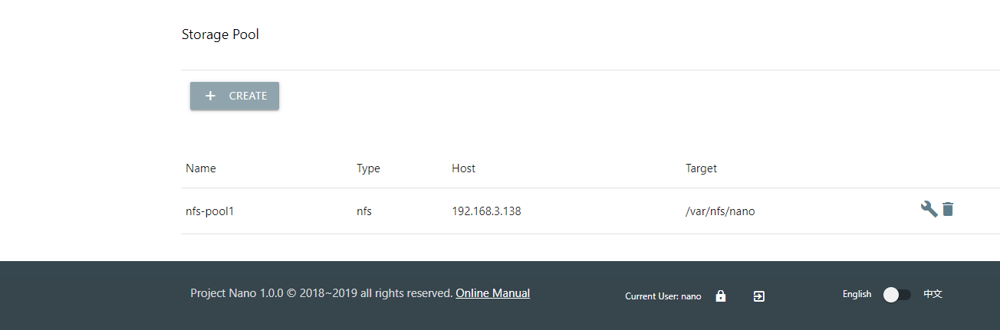

Modify Backend Storage
.......................................

A storage pool can attach to an existing computing pool or use to create a new computing pool. When a Cell added to the resource pool, the backend storage configuration will automatically synchronize.

For example, click the "modify" icon of the default resource pool, and select the "nfs-pool1" from the drop-down menu.

It recommends enabling the "Failover" option if High Availability is required. When a Cell node lost if failover enabled, all instances on that node will automate resumed on other nodes. See the chapter "platform-failover" for more detail.

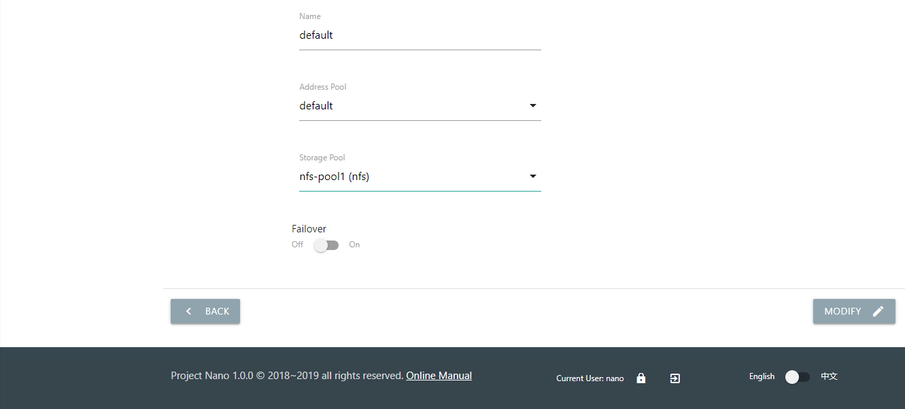

Check the ICON and property in the list after modification.

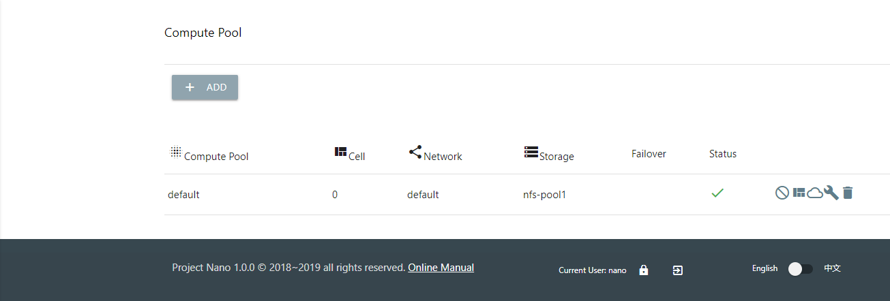

Once set up, you can start adding nodes to the resource pool. When you create an instance or snapshot in a pool that uses shared storage, its data stores on the NFS server automated.

Add Address Pool(optional)
==================================

By default, the virtual machine allocated by Nano directly obtain IP from physical networks through a bridged device. But for who want to manage instance's IP more precisely, the address pool may be a better solution.

An address pool contains multiple IP segments.

When an instance creates, a new IP allocated from the pool and attach through the DHCP service on the Cell node.

When the instance deleted, the attached IP release to the address pool, which can reallocate later.

Click the "Create" button in the pool list

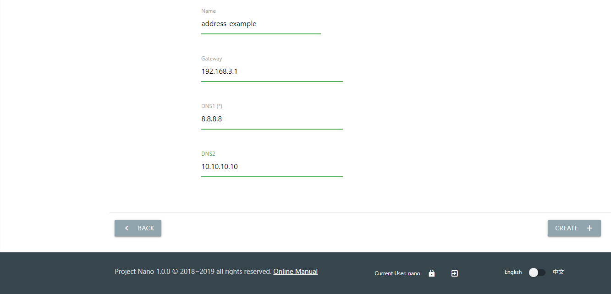

When an instance startup, it will fetch gateway and DNS in pool configuration via DHCP client.

After a pool created, add some usable address range in the detail page.

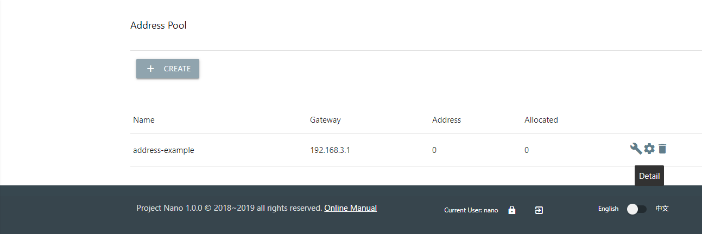

Click the "Add" button on the detail page, add a usable address range. When a new instance created, an IP will allocate in this range and attach to it using the DHCP service.

To avoid conflicts with existing network DHCP service,  please notes:

1. **Ensure that there is no address overlap between the existing DHCP network and the Nano address range.**

2. **Ensure that the address range is on the same subnet with the gateway, and reachable. The gateway IP should not appear in the usable range.Take the gateway IP "192.168.3.1" as an example, the address range should be "192.168.3.2~192.168.3.240/24".**

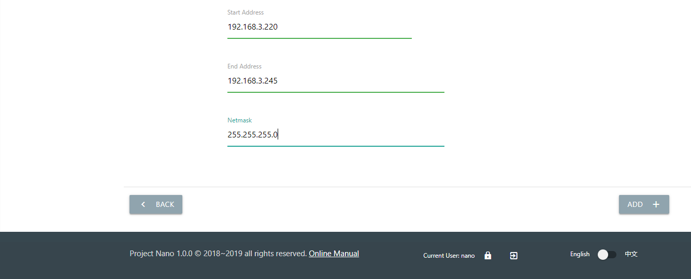

You can see the available ranges in the detail page after adding. You can also add multiple address ranges in an address pool if necessary.

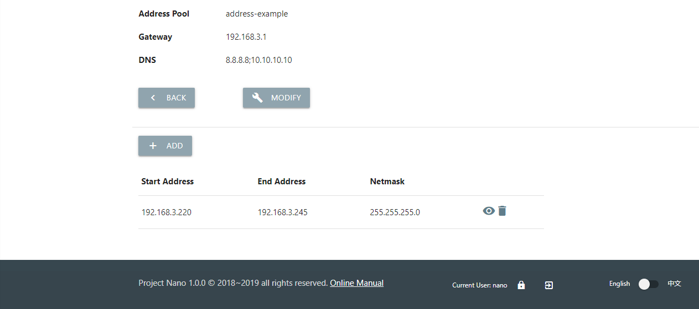

An address pool should attach to a resource pool before taking effect. Choose an address pool in the drop-up menu of the resource pool.

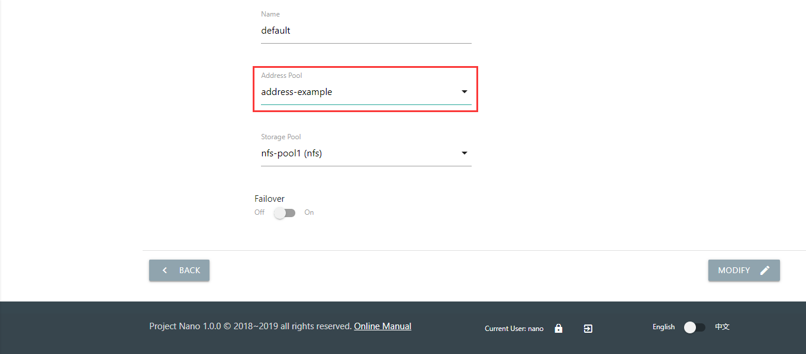

Check the list of resource pools to see if the modification OK.

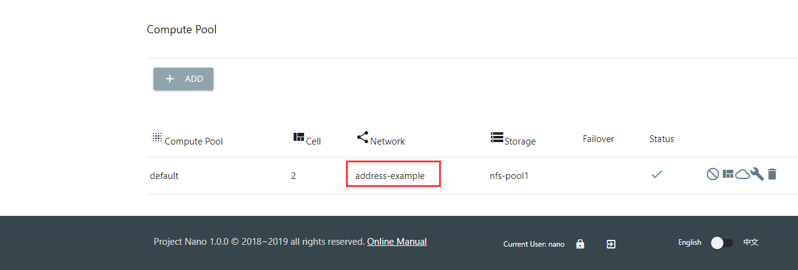

After the address pool configured, when creating a new instance, an IP is automatically allocated and attached.

You can view the attached IP in the instance detail or the address pool detail pages.

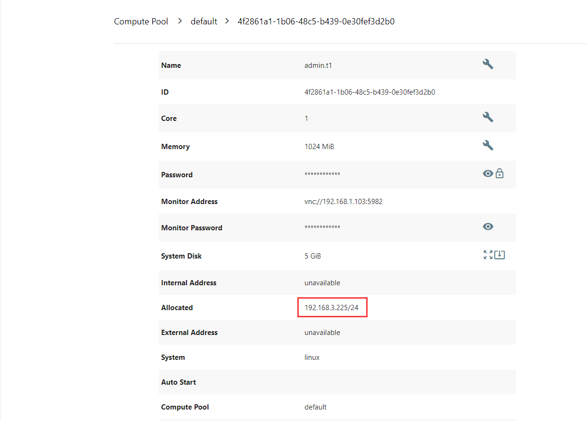

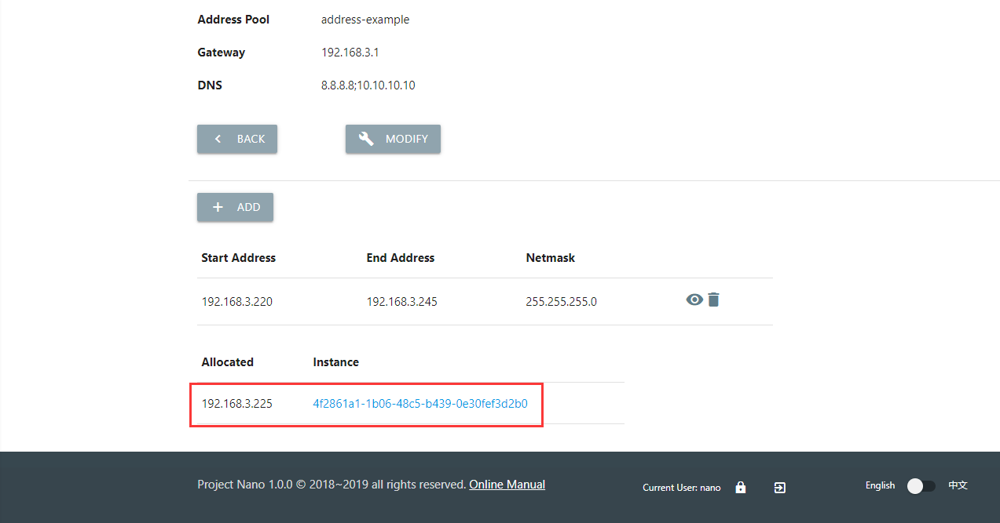

Note: An address pool can associate with multiple resource pools, you can change DNS or gateway of the address pool, also the association in real-time. But any allocated instance must release before unbinding the associated address pool.

Add Resource
================

Add Cell Node
..................

When the Nano starts for the first time, an empty resource pool named "default" created. You must add a Cell node to have enough resources to allocate instances.

On the "Resource Pool" menu, click the "cells" button of the "default" pool.

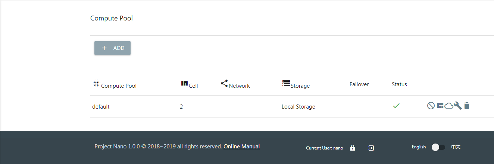

Click the "Add" button to add cell node.

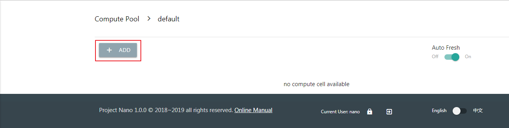

Select a Cell node available but not joined any resource pool in the drop-down menu.

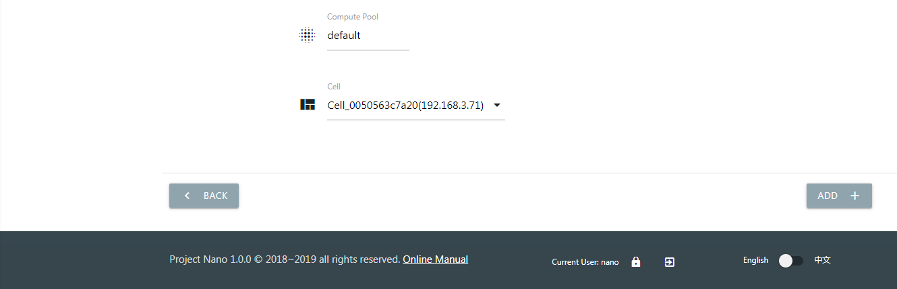

You can see that the new node is online after added the pool.

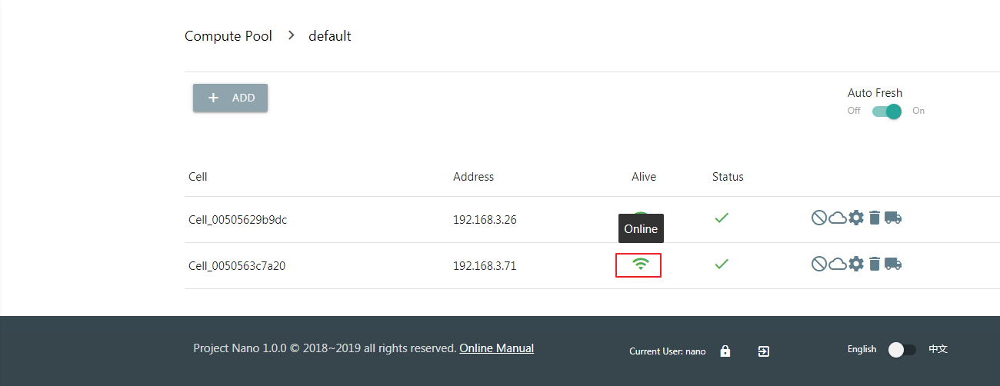

**Please note: You may receive a timeout warning when the Cell takes too long to join the pool if using shared storage. It does not matter in most cases, try refreshing the list to check status.**

*When using shared storage, ensure the backend storage attached successfully in the detail page of the Cell Node.*

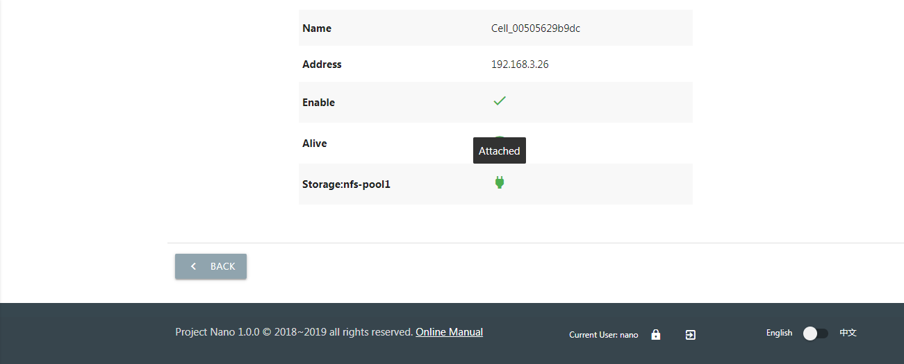

Once the Cell node and backend storage ready, you can begin creating new instances.

Upload Images
....................

an empty instance is no use at all, so we need to install an operating system and software.

Disk Images
,,,,,,,,,,,,,,,

A disk image store the system data of a original virtual machine,  which can fast clone batch of instances with the identical OS and software in a short time.

You can install Cloud-Init module in the disk image, for initializing administrator password, expanding system disk or formatting data disk automated.

The `Download <https://nanos.cloud/en-us/download.html>`_ page of the official site provides a pre-built image of CentOS 7.5 Minimal (one of them is embedded with Cloud-Init).

Download the image, click "Upload" in the "Images" menu to upload it. Then you can clone from this image when creating new instances.

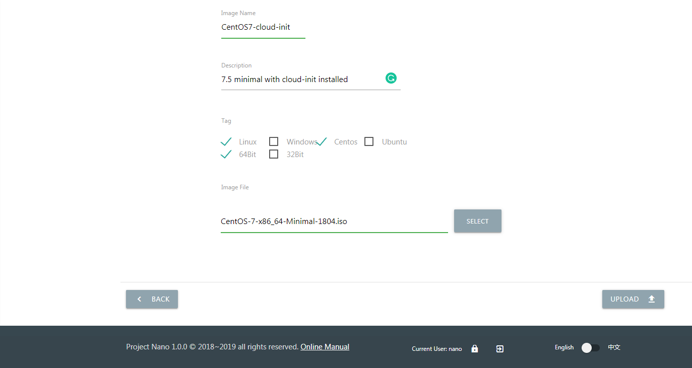

Media Images
,,,,,,,,,,,,,,,,

The media image represents a DVD data in ISO format, which can load into instance working as a physical CD for installing OS.

The media images usually use to build virtual machine template,  see chapters of instance and platform for more details.
