.. instance .

.. contents:: Chapters
  :depth: 2

-----------------------
Manage Instances
-----------------------

 **Please note: It recommends that directly connect instances to the physical network through a bridged interface on the host server, which obtains IP from the existing router as non-virtual servers. This mode also helps administrators to manage virtualized clusters as same as traditional clusters.**

Create Instance
===================

The instances in Nano is created based on a resource pool.

When the Core receives a creating request, it evaluates the free resources and the real-time load of each available Cell and chooses the one with the lowest weighted score to create.

The following parameters are required to create a new instance:

- Instance name: only numeric, letters and '- ' are allowed.
- Resource pool: the name of the resource pool that hosts the instance.
- The number of cores: The number of CPU cores allocated to the instance. It is not recommended to exceed the maximum number of physical threads of the Cell server.
- Memory: the amount of memory allocated for the instance, cannot exceed the maximum physical memory of the host node.
- System version: Nano optimizes hardware combination of the instance settings based on system version to provide better performance and compatibility. "Legacy System" recommends for older OS.
- System disk: Size of system volume for the instance.
- Data disk: Whether mounting an additional data disk on the instance.
- Autostart: Instances automatically start when the Cell server power on if enabled.
- System image: Whether cloning system disk of the new instance from a pre-built image.
- CPU priority: High priority instances guarantee more system resources when they are busy.
- IOPS: Set the maximum read and write limit for disk IO, which is unlimited by default
- Inbound/Outbound Bandwidth: Sets the network bandwidth limit, which defaults to unlimited

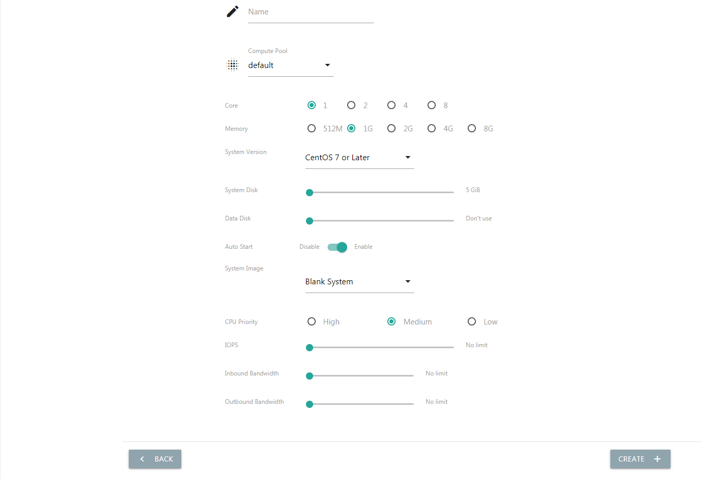

There are three kinds of system image available: the blank,  the pre-built, and pre-built embedded with Cloud-init modules. The official site of Nano provides two pre-built images of CentOS 7.5 Minimal for `Downloading <https://nanos.cloud/en-us/download.html>`_ .

Blank System
------------------

The default blank image means that there are not any operating system or software after the instance created, and you need to load a media image to install some.

The blank system is usually used to customize a template instance. See the chapter of building an image for more details.

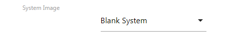

Pre-built Images
---------------------

A pre-built image already installed with the operating system and some software, and may even have some optimizations or modification. The image can build from a template instance, or upload via web portal directly.

Choose a pre-built image when creating a new instance. You will have a clone identical to the original template after created, which is usable out-of-the-box.

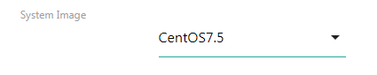

Pre-built Images Embedded With Cloud-init Module
-----------------------------------------------------------

This kind of image adds cloud-init and cloud-utils components (which can install using yum tools on CentOS) base on a normal pre-built one. Cooperating with Cloud-Init service provided by Nano, it is easily initializing administrator password, expanding system disk or formatting data disk automated.

When using a Cloud-Init embedded image, don't forget turning on the CI option and configure initialization parameters on the creating page.

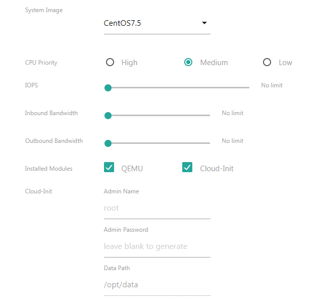

*Please note: If you need automatically format and mount the data disk while expanding the system disk, both a Cloud-Init embedded image and option enabled when creating are required.*

Start/Stop And Monitor Instance
========================================

Users can manage the life cycle of a virtual machine. A new instance stopped by default, and you can use the following functions.

.. image:: images/3_5_stopped_buttons.png

- Start: start the instance into the running state
- Start With Media: Select a media image to boot the instance, usually is used to install the operating system or restore the system as the LiveCD.
- Snapshot: Manage snapshots created for this instance.
- Build Disk Image: Build a new disk image based on the current disk status for batch creation.
- Reset System: Restore the current system data to a specified system image.
- Delete: Permanently delete the instance.
- Migrate: Migrate instances to other nodes if created base on shared storage.
- Monitor: Monitor the real-time resource usage of the instance.
- Detail: You can configure and manage the instance in more detail.

When the instance is running, the control buttons change to below figure

.. image:: images/3_6_running_buttons.png

from left to right:

- Remote Control: Open the secure VNC monitoring page to control the instance directly.
- Stop: Simulate pressing the power button, invoke to close the disk and then shut down. (note: The ACPID service must install on the CentOS instance to take effect)
- Force Stop: Forced shutdown, similar to a power outage, can lead to data inconsistency or even disk damage.
- Reboot: Restart the instance gracefully, usually without affecting the disk data (the ACPID service required for a CentOS instance).
- Force Reboot: Reboot instance immediately, can lead to data inconsistency or even disk damage.
- Insert/Eject Media: Insert the media image into the instance, or eject from it.
- Monitor: Monitor the real-time resource usage of the instance.
- Detail: You can configure and manage the instance in more detail.

On the monitoring page, you can operate directly on the instance as managing a local server. This feature does not require any software on the guest, so it is a guaranteed method for maintaining even the network or system of the internal system corrupted.

.. image:: images/3_7_control_instance.png

The monitoring page also provides the following utility buttons, from left to right:

.. image:: images/3_8_control_buttons.png

- Send Ctrl+Alt+Del: For operating system login and restart such as Windows.
- Insert Media Image: Load into the CD drive of the instance to install additional software and systems.
- Eject Media Image: Eject from the instance.
- Shutdown: Simulate pressing the power button, invoke to close the disk and then shut down. (note: The ACPID service must install on the CentOS instance to take effect)
- Reboot: Restart the instance gracefully, usually without affecting the disk data (the ACPID service required for a CentOS instance).
- Force Reboot: Reboot instance immediately, can lead to data inconsistency or even disk damage.

 **Besides the embedded monitoring page, you can also access the instance by third-party VNC software using the authenticate info queried from the detail page.**

Modify Configuration in the detail
=======================================

Click the "monitor" button in the control bar of an instance in the list.

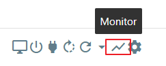

Learn about real-time resource usage and status about the running instance in the dashboard:

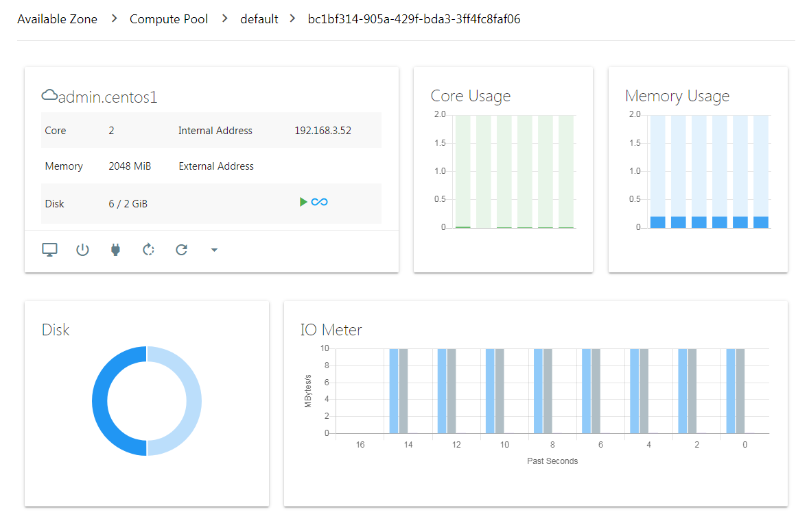

When you need to reconfigure the instance, you can click the "detail" button.

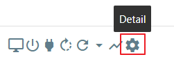

Into the detail page:

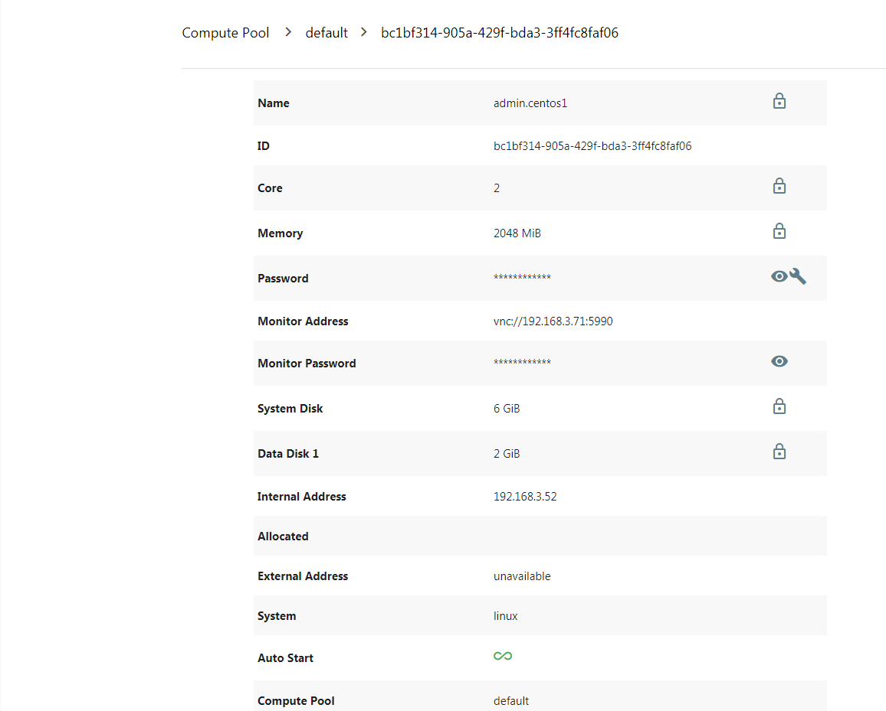

The details page provides the following functions:

- Modify instance name
- Modify the number of cores, memory, and other configuration about resources.
- Expand or shrink disk volume. (It only reduces the disk space occupied by the physical files, not the logical volume size of the instance. It may take a long time to run, so it is safe to ignore the timeout warning in most cases.)
- Change the administrator password (the qemu-guest-agent required in the guest system)
- Query the authenticate info about VNC
- Modify CPU priority, disk IO, and network bandwidth limits.

Some functions require a running instance, and some require a stopped one.

Snapshots
=============

Snapshots are the stored states of an instance, which can restore when data corrupted or misoperation if necessary.

When an instance stopped, click the "snapshot" button into snapshot page.

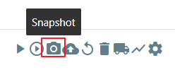

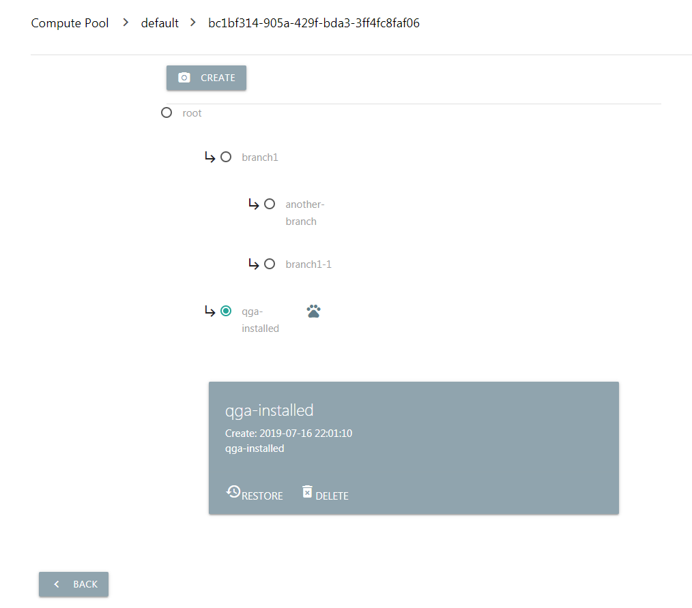

You can input a name and description, create a new snapshot to store the current instance state.

.. image:: images/3_15_create_snapshot.png

You can also resume to a specified system state or delete a snapshot.

.. image:: images/3_16_restore_snapshot.png

Below ICON mark the current activity.

.. image:: images/3_17_active_snapshot.png

A snapshot still active or depend by others cannot be deleted.

Load Media Image
=====================

Administrators can load a media image into running instances to install software or operating systems.

Click the "insert" button in the control bar of a running instance.

In the pop-up dialog, select the target media image. The insertion will take effect immediately, which is as simple as inserting a DVD into a notebook.

.. image:: images/3_19_insert_media.png

An icon will indicate that a media image attached when insert success:

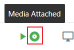

Click the "eject" button can unload the image from the instance.

Reset System
==================

When you need to restore or install a new operating system, you can reset the system directly from a disk image.

Click the "reset system" button in a stopped instance.

Select the image you want to install and click to start.

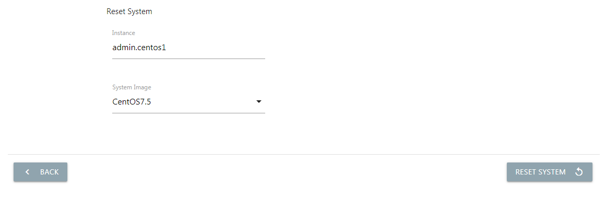

After reset complete, the system disk of the instance will restore to the newly installed state.

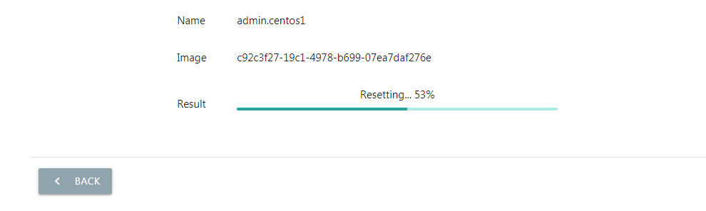

Migrate Instances
=====================

Instances migration helps adminstrator to manually optimize the resource configuration and daily downtime maintenance. **Note: the migration only enabled in the resource pool using shared storage.**

Migrate Single Instance
---------------------------

Single migration can migrate an instance to a specified Cell node, click the "Migrate" button of a stopped instance in the list.

.. image:: images/3_migrate_instance.png

Select the target node in the pop-up dialog, confirm and wait for the migration to complete.

.. image:: images/3_migrate_instance_confirm.png

After the migration completes, you can see that the instance hosting node has changed. if you use a third-party remote control tool, please check the latest monitor address in the detail page after migration.

.. image:: images/3_migrate_instance_finish.png

Migrate Whole Node
-----------------------

Whole node migration moves all instances on one node to other nodes, usually for downtime maintenance or server relocation.

Click the "Migrate" button in the Cell list.

.. image:: images/3_migrate_all_instance.png

Select the target node in the pop-up dialog, confirm and wait for the migration to complete.

.. image:: images/3_migrate_all_instance_confirm.png

Batch Processing
====================

Batch processing is quite effective when managing a large number of instances.

Batch Creating
------------------

Batch creating is identical to the original creation besides it creates a group of instances with similar configuration. Click the "Batch Create" button in the instance list.

.. image:: images/3_batch_create_cn.png

Batch Deleting
-------------------

Entering batch mode in the instance list, then you can select multiple instances and delete them at the same time.

.. image:: images/3_batch_delete_cn.png

Batch Stopping
-----------------

Entering batch mode in the instance list, then you can select multiple instances and stop them at the same time.
