.. platform .

.. contents:: Chapters
  :depth: 2

-------------------
Manage Platform
-------------------

Nano provides a bunch of utility functions to simplify the daily maintenance.

Dashboard
===========

The landing page of the web portal provides a global usage dashboard, which covers both virtual and physical resources, helps to understand the real-time system load.

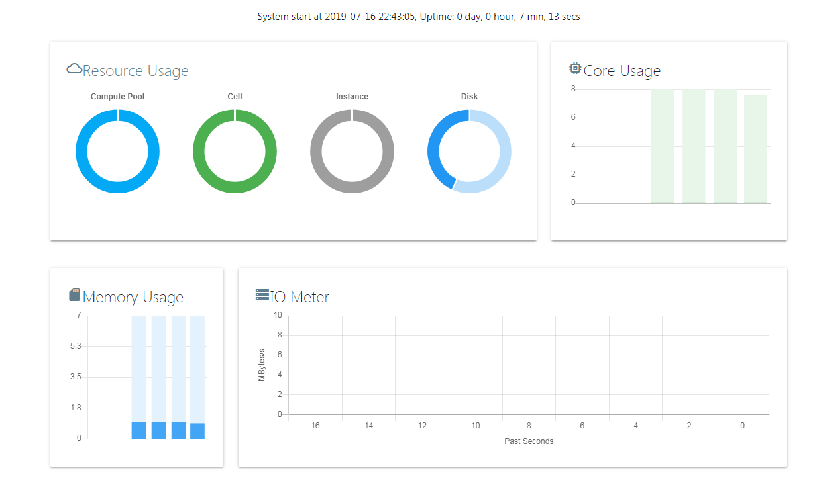

You can click on the dashboard to drill down to see the detail usage of resource pools, host nodes, or instances.

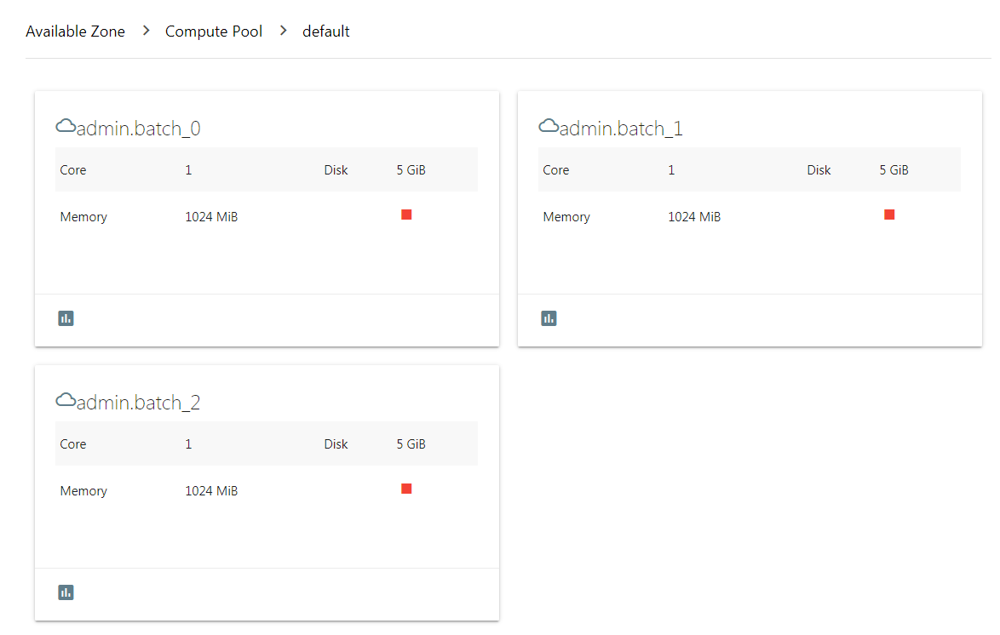

Add Resource Node
=====================

When the system load is heavy, you can add a new Cell node to increase the resources available in the pool.

First, you need to deploy and start the Cell module on a new server, and then click the "Add" button in the Cell list.

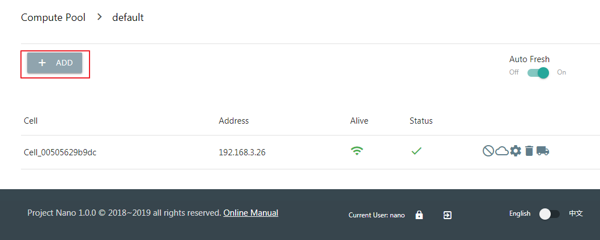

Choose the newly installed node from the drop-down menu.

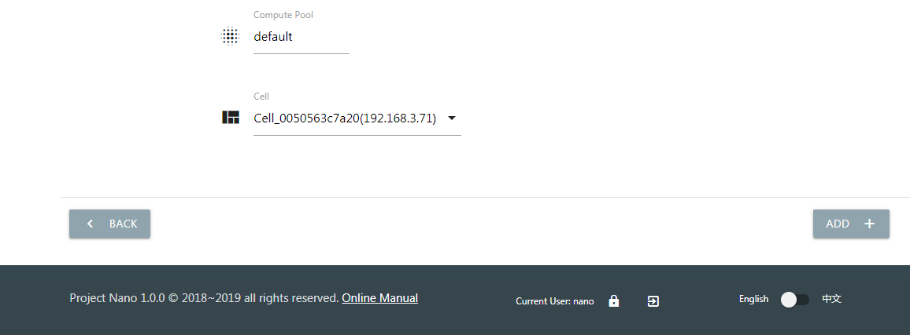

When the status of the Cell node changes to Online, it will able to host new instances.

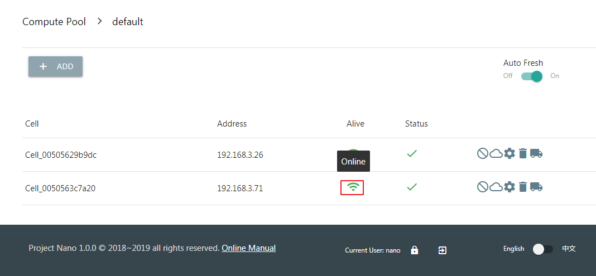

Build Template Image
========================

Nano can make the system data of any instance into a disk image, and then quickly clone a new one from the image. The cloned instance has an operating system and software identical to the original one.

.. image:: images/4_image_transport.png

To build a template image, you should create an empty instance without a data disk, and then install the operating system and software by uploaded ISO and network.

When building a template instance, consider the following steps. (Take the CentOS 7 as an example)

- Set default hostname and password.
- Bring up the network and enable DHCP to get IP.
- Install the ACPID service to enable shutdown and restart.
- Install the qemu-guest-agent to support online password modification, memory usage monitoring, etc.
- Update the latest software using yum.
- Install the cloud-init/cloud-utils if automatically initialization required.

After configuration completed, shut down the instance. Click the "BUILD" button in the "Images" page, select previous template from the drop-down menu, and click to create.

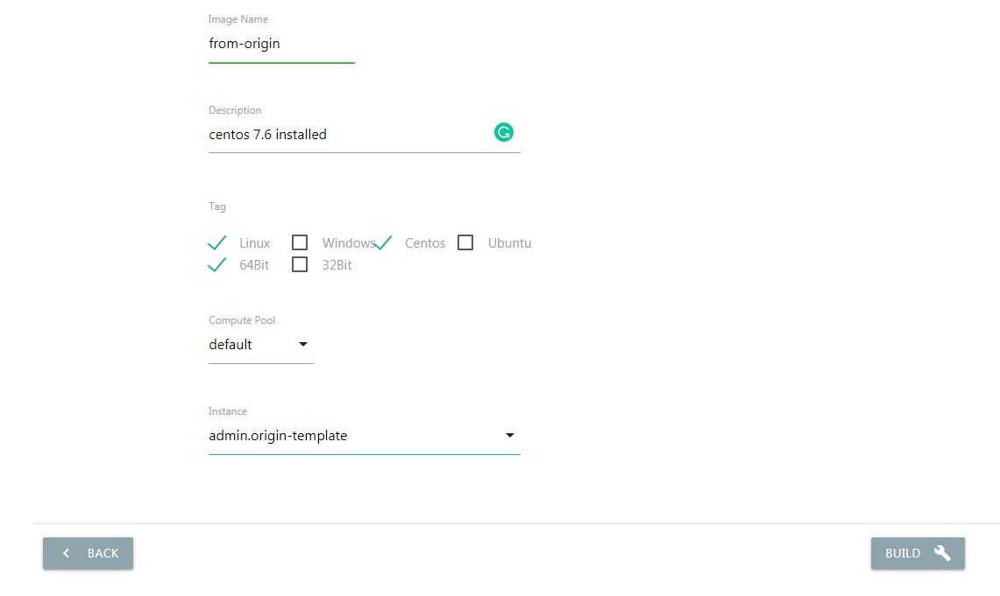

When the image built finished, you can clone from it when you create a new instance.

User Management
===================

Administrators can manage the accesses of users, groups, and roles.

The access control is base on the menu items. A role defines the menu items can access. A group has multiple roles.

After the user logs in, the menu list creating based on the roles of user group belongs. A user can only belong to one user group.

Role
--------

A system can have multiple roles, and each owns a set of menu items it can use.

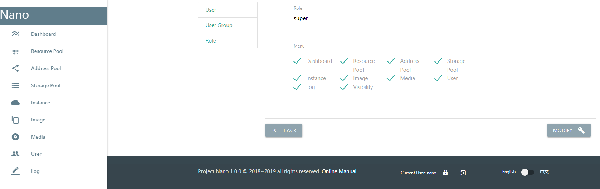

User
--------

A user account is an identity to log in the system, and also the required key to check resource owner and visibility. Click the "New" button in the user list, and input required info to create a new account.

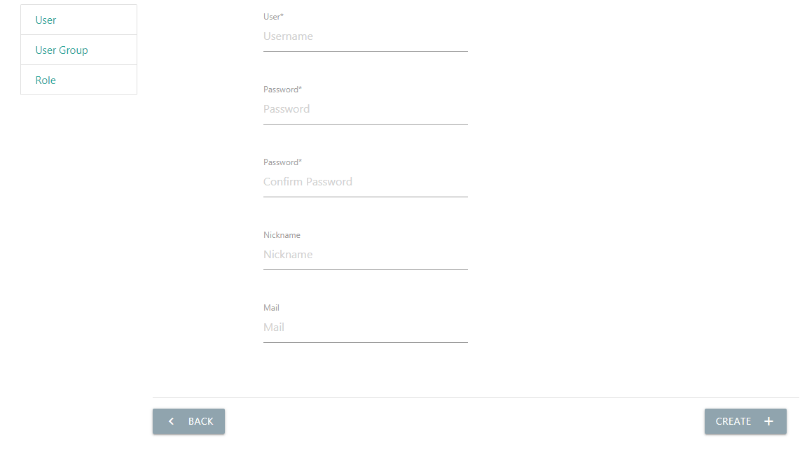

**Note: Although the new account can log in, it must add to a user group to access menu items.**

User Group
--------------

The user group is the core of permissions. A group can have multiple roles. And the member can access all menu items of roles belongs to the group.

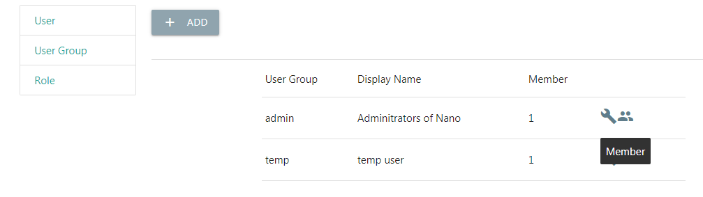

In the group list, enter the list of members.  Click the "Add" button and choose an existed user you want to add to the group.

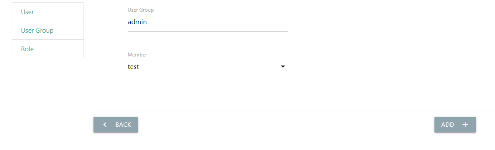

After the addition, the user can access the authenticated menu when login.

Resource Visibility
-----------------------

Instances, disk images, and media images are system resources which only visible by their creator by default.

Through visibility settings, administrators can allow access to resources created by other users within the same group for resource sharing.

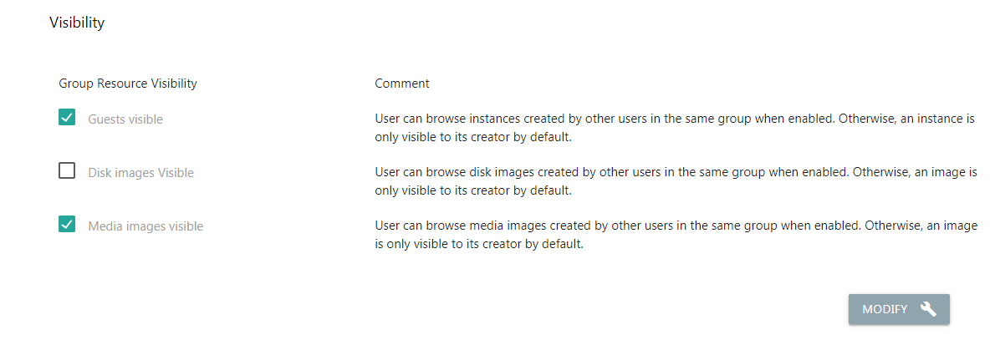

Password Modification
-------------------------

Logged-in users can click the button at the bottom to change their password.

.. image:: images/4_change_password.png

Operate Logs
================

Nano records user operating logs, including login failures, to audit user operations and troubleshoot.

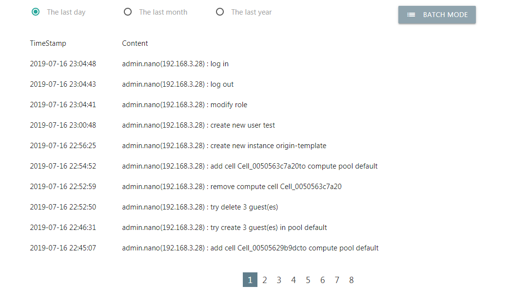

Upgrade System
==================

All modules of Nano are compiled binary without any external library dependency, and configuration and data file formats are usually backward compatible.

It highly recommends that executing the installer and selecting "4" to upgrade all modules automatically.  The installer will check which module installed need to update, and stop and restart a running module automated.

When you have a problem with the automatic upgrade, you manually upgrade all modules.

All you need is stop a running module, replace the binary and restart. The only exception is that the FrontEnd module also contains resource files need to replace.

Assuming all modules installed in the path "/opt/nano".

::

  Download and unzip
  $cd ~
  $wget https://nanos.cloud/media/nano_installer_1.0.0.tar.gz
  $tar zxfv nano_installer_1.0.0.tar.gz

  Replace Cell
  $cd /opt/nano/cell
  $./cell stop
  $cp ~/nano_installer/bin/cell .
  $./cell start

  Replace Core
  $cd /opt/nano/core
  $./core stop
  $cp ~/nano_installer/bin/core .
  $./core start

  Replace FrontEnd
  $cd /opt/nano/frontend
  $./frontend stop
  $cp ~/nano_installer/bin/frontend .
  $\cp ~/nano_installer/bin/frontend_files/resource/. resource/ -Rf
  $./frontend start

Network Change
==================

Core and FrontEnd use the specified address to provide services, when the server IP changes, you need to modify the configuration IP and restart the module.

When the IP of the Cell Server changed, you only need to restart the module. It will discovery the networking using the multicast protocol and rejoin the communication domain automated.

When migrating the whole system or moving to a different network, modify the listening IP and multicast configuration at first. Please remember starting the Core before the Cell,  finish new network discovery and switching.

Failover
============

You can enable the Failover in the resource pool using shared storage.

If a Cell node lost when the Failover enabled, all instance on that node will migrate automatically to other nodes in the same pool.

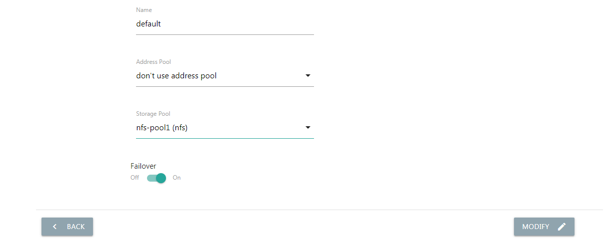

If the instance is autostarting, the new node will automatically start it after the migration.

**If the lost Cell node rejoins the pool, all instances on the Cell clear automatically and the Cell is disabled. The administrator needs to enable the node manually after that.**

Disable Node
================

Nano will select the node with the lowest load to create a new instance by default. But users can disable the Cell node manually to avoid host new instances on that node, easy to maintain or balance node load.

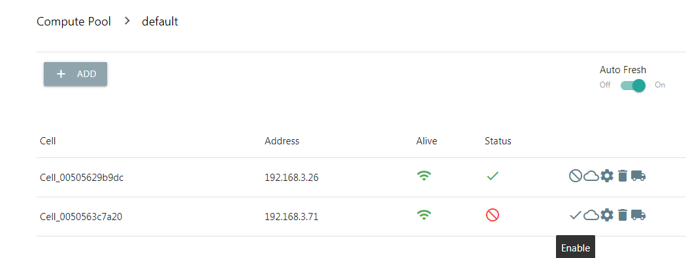

On the disabled node, all instances work without any different. Disabled nodes can enable manually later to resume hosting new instances.

Multilingual
================

The web portal currently supports both Chinese and English, switch it in the page footer.
